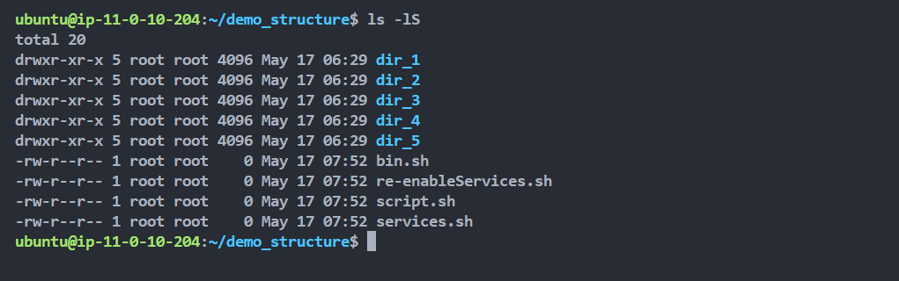

# File Management in Linux

### `ls` command

```bash
ls
```


### 1. List all files in **long list** format

```bash
ls -l
```


### 2. List all hidden files and directories

```bash
ls -a
```


### 3. Display file size in a human-readable format

```bash
ls -lh
```


### 4. Distinguish directories and files

```bash
ls -F
```


### 5. Sort files in reverse order alphabetically

```bash
ls -lr
```


### 6. List files recursively


### 7. List files by specific file extensions

```bash
ls *.sh
```


### 8. List files by human readable file size

```bash
ls -lh
```


### 9. List files by modification in reverse order

```bash
ls -ltr
```


```bash
ls -lt # to list in newest to oldest order
```


### 10. List files by file size

```bash
ls -lS
```



### 11. List directory information and files under directory


### 12. Additonal Tip: Using Alias to create `ls` alias command

```bash
alias listAll="ls -la"
```


