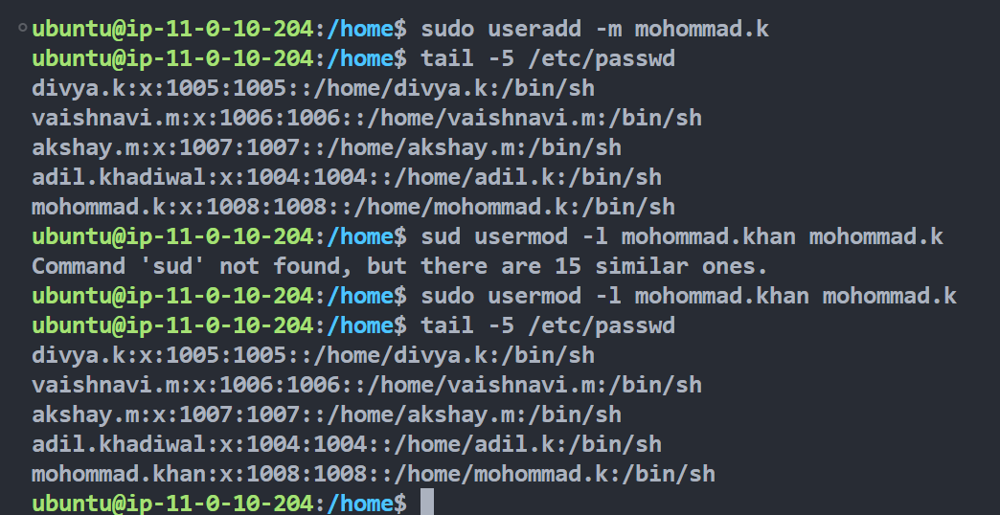

# User Management Commands Usage and Examples

### Current logged in user

```bash
whoami
```

### switch to the root user including environment

```bash
sudo su -
```

What is the differnece between using `su` and `su -`, explained in [this](https://www.geeksforgeeks.org/difference-between-su-and-su-command-in-linux/).

### Add a new user

```bash
useradd userName
```

### Set new password for the user

```bash
passwd username
```

### List the users

```bash
tail -5 /etc/passwd
```

### By default the useradd command does not create home directory for that user,

Use `-m` flag to create new user with their own directories

```bash
useradd -m username
```

### Update user name

```bash
usermod -l <newusername> <oldusername>
```

```bash
usermod -l darshan.hulswar darshan.h
```



### Lock and unlock user account

#### Lock the user account

```bash
usermod -L <username>
```

```bash
usermod -L darshan.hulswar
```


#### Unlock the user account

```bash
usermod -U <username>
```

### Add Group

```bash
groupadd <groupname>
```


### Add user to the group

```bash
usermod -aG <groupname> <username>
```

```bash
usermod -aG devops-team darshan.hulswar
```


#### Remove user from the group

```bash
deluser <username> <groupname>
```

```bash
deluser divya.k devops-team
```


### Delete user

```bash
userdel <username>
```


you might have a question now? 🤔 what is the difference between `userdel` and `deluser`

> You can refer to [this](https://docs.bswen.com/blog/2025-02-04-linux-deluser-userdel/) article which explains the difference.

### Delete group

```bash
groupdel <groupname>
```

```bash
groupdel devops-team
```


### Change the ownwership of the file

```bash
chown <username> <file/dirname>
```


```bash
chown manoj.krishnappa ./configurations
```


### Change group ownwership

```bash
chown :<groupname> <file/dirname>
```


### Change the both group and owner

```bash
chown <username>:<groupname> <file/dirname>
```

